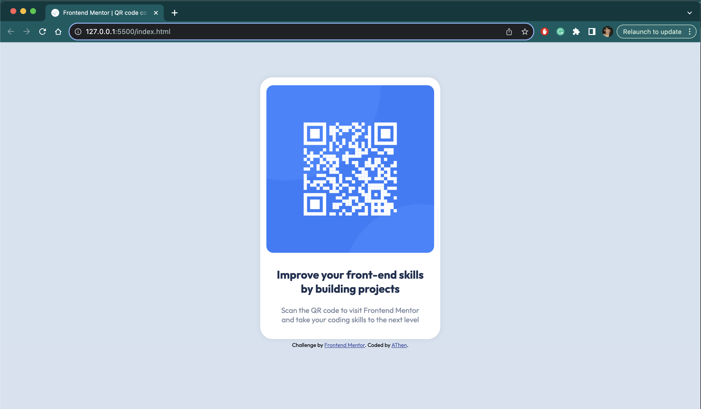

# Frontend Mentor - QR code component solution

This is a solution to the [QR code component challenge on Frontend Mentor](https://www.frontendmentor.io/challenges/qr-code-component-iux_sIO_H). Frontend Mentor challenges help you improve your coding skills by building realistic projects. 

## Table of contents

- [Overview](#overview)
  - [Screenshot](#screenshot)
  - [Links](#links)
- [My process](#my-process)
  - [Built with](#built-with)
  - [What I learned](#what-i-learned)
  - [Useful resources](#useful-resources)
- [Author](#author)

## Overview

### Screenshot




### Links

- Solution URL: [GitHub](https://github.com/a-then/frontend-mentor-solutions.git)
- Live Site URL: [Add live site URL here](https://your-live-site-url.com)

## My process

### Built with

- Semantic HTML5 markup
- CSS custom properties

### What I learned

This is my first Frontend Mentor problem. I decided to do it without using any libraries or frameworks, just straight HTML and CSS. 

It was a good practice starting from scratch as I had to revisit some of the most basics CSS properties.

I chose to use article HTML element as my container element as I gather a QR Code is a shareable part of any website and it makes sense on its own.

```html
<article class="cardHolder">
    ...
</article>
```

### Useful resources

- [MDN Web Docs](https://developer.mozilla.org/en-US/) - This one will forever lived in my bookmarks tab. Go-to reference for HTML, CSS and JS.

## Author

- Website - [My Portfolio](https://a-then.github.io/AThenPortfolio-2023/)
- Frontend Mentor - [@a-then](https://www.frontendmentor.io/profile/a-then)
- Twitter - [@athen](https://twitter.com/AThen)